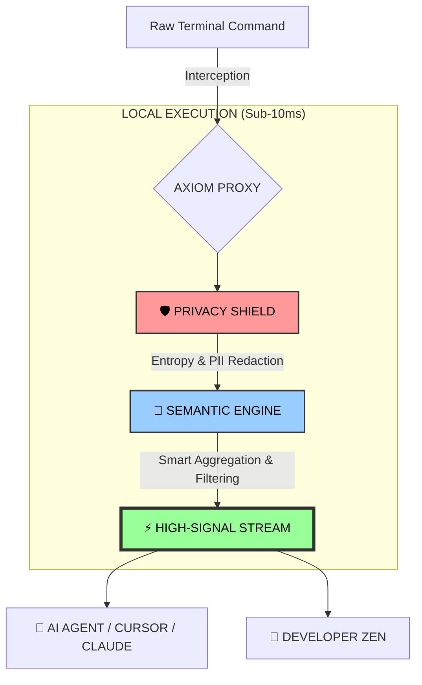

# AXIOM: The Semantic Firewall for the AI Age 🦀

<p align="center">
  
  
  
  
</p>

<p align="center">
  <strong>"Don't let your secrets become LLM training data. Stop burning context on terminal noise."</strong>
</p>

---

## 🛡️ Security First: Protect Your Secrets

AI Agents like **Cursor**, **Claude Code**, or **Gemini CLI** read your terminal. If a command leaks an API key or an error contains a database URI, **that data is sent to the cloud.** 

**Axiom stops this locally.**

### ❌ The "Panic" Moment (Without Axiom)
```text
$ npm install --secret=sk_live_51Mzh... [LEAKED TO LLM]
npm WARN deprecated ... (500 lines of noise)
fetch http://registry.npmjs.org/...
downloading [####################] 100%
added 124 packages...
```

### ✅ The "Zen" Moment (With Axiom)
```text
[AXIOM] 🛡️ Privacy Shield: 1 secret detected & redacted.
[AXIOM] ⚡ Collapsed 124 lines of fetch/progress noise.
✔ Added 124 packages.
[AXIOM] 📉 Context Savings: 98.5% (Saved 4,200 Tokens)
```

---

## 🚀 Why Axiom?

### 💰 1. Token Economy (For your AI)
Standard command outputs are 90% repetitive noise. Axiom transforms raw bytes into **semantic intent**, reducing your token bill by **60-90%** while making the AI smarter and faster.

### 🛡️ 2. Privacy Shield (For your Data)
A local-first **Entropy Scanner** identifies high-randomness strings (API keys, Secrets, PII) and masks them **before** they reach the AI's context window.

### 🧘 3. Developer Zen (For you)
Axiom isn't just for AI. Use it to clean up massive `docker logs`, `ps`, or `ls` outputs. Focus on the errors that matter, not the successful boilerplate.

---

## 🏗️ How it Works: The Signal Funnel

Axiom acts as a local high-performance filter between your tools and your context window.



---


### 1. One-Step Install
```bash
cargo install --git https://github.com/mpineda/axiom
axiom install
```

### 2. Choose your "Axiom Style"

| Method | Usage | Best for... |
| :--- | :--- | :--- |
| **Manual** | `axiom <command>` | Occasional use & testing. |
| **Transparent** | `alias npm='axiom npm'` | Set and forget. Total terminal clarity. |
| **Autonomous** | Use `AGENTS.md` / `GEMINI.md` | Forcing AI Agents to use Axiom by default. |

---

## 🤖 AI Integration: The Protocol

Axiom includes specialized instruction files for AI Agents. By placing **`AGENTS.md`** or **`GEMINI.md`** in your project root, you tell the AI: 
> *"I have Axiom installed. Use it for all noisy commands to save my context and protect my secrets."*

---

## 📖 Documentation / Documentación

Choose your language for the deep dive:

### 🇺🇸 [English (EN)](docs/en/README.md)
- 🚀 **[Installation & Setup](docs/en/getting-started/installation.md)**
- ⚡ **[Quick Start Guide](docs/en/getting-started/quick-start.md)**
- 🛡️ **[Privacy & Telemetry](docs/en/user-guide/telemetry-and-privacy.md)**
- 🧱 **[Architecture Guide](docs/en/developer-guide/architecture.md)**

### 🇪🇸 [Español (ES)](docs/es/README.md)
- 🚀 **[Instalación](docs/es/empezando/instalacion.md)**
- ⚡ **[Inicio Rápido](docs/es/empezando/inicio-rapido.md)**
- 🛡️ **[Privacidad Local](docs/es/guia-usuario/telemetria-y-privacidad.md)**

---

## 🤝 Community & Contributing

Axiom is an open-source movement to make terminal-to-LLM streaming secure and efficient. Join us!

Axiom Core is licensed under the **Apache License 2.0**.

---
<p align="center">
  <i>"From raw bytes to semantic intent."</i>
</p>
