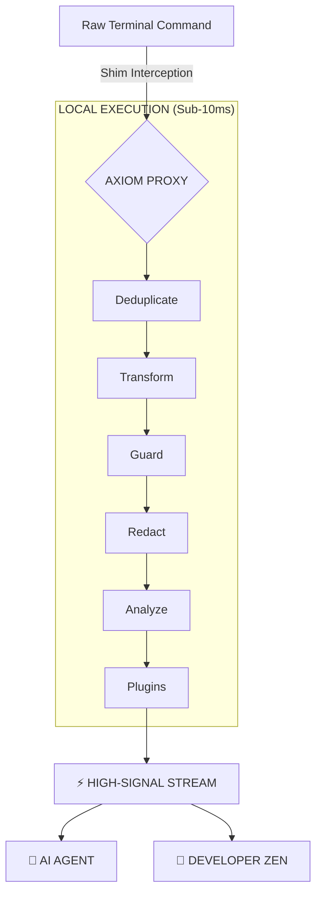

# AXIOM: The Semantic Token Streamer 🦀

<p align="center">
  
  
  
  
</p>

<p align="center">
  <strong>Stop burning context tokens on terminal noise. Redact secrets locally. Make AI Agents 10x more efficient.</strong>
</p>

---

## 🛡️ Why Axiom?

AI Agents (**Cursor**, **Claude Code**, **Gemini CLI**) read your terminal. Standard command outputs are 90% repetitive noise (progress bars, fetch logs, successful builds). 

**Axiom acts as a high-performance local filter:**
1.  **Deduplication:** Collapses 1,000s of identical lines into a single informative summary.
2.  **Semantic Insight:** Groups logs by intent (e.g., "Compiling 42 crates").
3.  **Privacy Shield:** Redacts API keys, PII, and secrets **before** they reach the cloud.
4.  **Token Economy:** Reduces terminal context usage by **60-95%**, saving you money and preventing LLM "brain fog."

---

## 🚀 Installation (v0.1.0)

### The "One-Liner" (Linux & macOS)
```bash
curl -sSfL https://raw.githubusercontent.com/pinedamg/axiom-cli/main/install.sh | sh
```

### Homebrew (Official Tap)
```bash
brew tap pinedamg/tap
brew install axiom
```

### Post-Install Setup
After installing the binary, run the interactive setup to configure your shell and AI context:
```bash
axiom install
```

---

## 🛠️ Industrial Toolkit

Axiom includes a suite of tools for the AI-age developer:

*   **`axiom <command>`**: Proxy any command (e.g., `axiom npm install`).
*   **`axiom gain`**: View your efficiency dashboard and estimated USD savings.
*   **`axiom doctor`**: Run a system health check and auto-repair shims/PATH.
*   **`axiom last`**: Recover the raw, uncompressed log of the last command (emergency exit).
*   **`axiom self-update`**: Keep your CLI up to date with the latest releases.

---

## 🤖 AI Agent Integration

Axiom is designed to be "Agent-Aware." It automatically syncs instructions for:
*   **Claude Code** (`CLAUDE.md`)
*   **Cursor** (`.cursorrules`)
*   **Gemini CLI** (`GEMINI.md`)
*   **Windsurf** (`.windsurfrules`)

By using Axiom, you tell the agent: *"Use the `axiom` prefix for noisy commands. Protect my context window."*

---

## 🏗️ Architecture: The Signal Funnel



---

## 🤝 Contributing & License

Axiom is built in Rust for maximum performance and security. We welcome contributions to our [Structural Schemas](config/schemas/).

Licensed under the **Apache License 2.0**.

---
<p align="center">
  <i>"Protecting your context, securing your data."</i>
</p>
