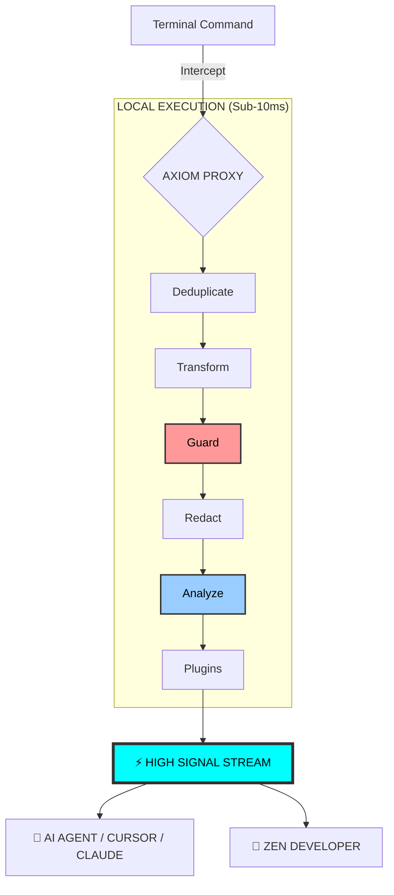

# Axiom Documentation

Welcome to the official documentation for **Axiom**, the Semantic Token Streamer for AI Agents.

---

## 🤔 Why Axiom?

Current AI agents (like Cursor, Claude Code, or Gemini CLI) are incredibly powerful but **context-hungry**. When you run a command like `npm install`, the terminal outputs hundreds of lines of progress bars and dependency notices.

**The Problem**:
1.  **Noise**: 90% of that output is redundant for the AI.
2.  **Cost**: You pay for every single token of that noise.
3.  **Privacy**: You might accidentally send API keys or secrets embedded in logs to the LLM provider.

**The Solution**:
Axiom acts as a **Semantic Firewall**. It intercepts your command output locally, redacts secrets, collapses repetitive noise into single lines, and delivers a high-signal stream to your AI agent.

---

## 🏗️ How it Works: The Signal Funnel

Axiom acts as a high-performance local filter between your tools and your context window.

---

## 📖 Table of Contents

- [🚀 Getting Started](getting-started/installation.md)
  - [Installation](getting-started/installation.md) - How to get up and running.
  - [Quick Start](getting-started/quick-start.md) - Your first `axiom` command.
- [💡 User Guide](user-guide/core-concepts.md)
  - [Core Concepts](user-guide/core-concepts.md) - Semantic compression and privacy shield.
  - [Telemetry & Privacy](user-guide/telemetry-and-privacy.md) - What we collect (and what we don't).
  - [CLI Reference](user-guide/cli-reference.md) - Every command explained.
- [🤖 AI Integration](ai-integration/agents.md)
  - [Instructions for Agents](ai-integration/agents.md) - How to tell your AI to use Axiom.
- [🛠️ Developer Guide](developer-guide/architecture.md)
  - [Architecture](developer-guide/architecture.md) - How the Rust core is built.
  - [Creating Schemas](developer-guide/schemas.md) - Add support for new CLI tools.
  - [WASM Plugins](developer-guide/plugins.md) - Extend Axiom with WebAssembly.
  - [Contributing](developer-guide/contributing.md) - Join the community.
- [🗺️ Project Management](project/roadmap.md)
  - [Roadmap](project/roadmap.md) - Current progress and future vision.
  - [Development Log](project/dev-log.md) - Internal technical log.
  - [Pulse Control Plane](project/pulse-control-plane.md) - Standalone observability hub.

---

## 📚 Glossary

- **Semantic Firewall**: The core concept of Axiom. It filters output based on its *meaning* (semantics), not just simple regex.
- **Token Streamer**: Refers to Axiom's ability to "stream" only the most relevant tokens to an LLM.
- **Entropy Scanner**: A tool that calculates the "randomness" of a string. High entropy often indicates an API key or secret.
- **Schema**: A YAML configuration file that tells Axiom how a specific tool (like `npm` or `git`) behaves.
- **LLM Context Window**: The limited amount of text an AI model can process at once. Axiom saves this valuable space.
