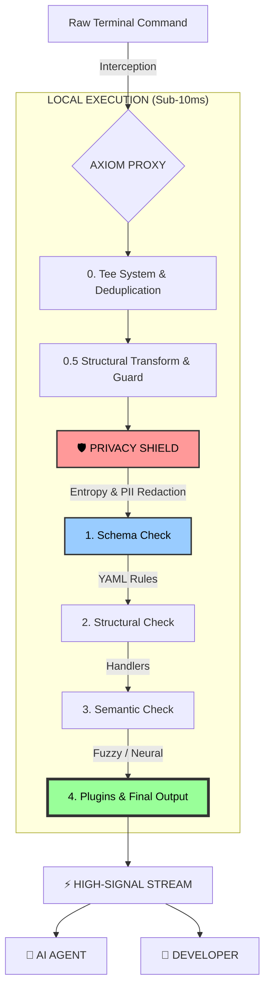

# AXIOM: System Architecture

This document describes the high-performance, layered architecture of **Axiom**. It is designed for minimal latency (<10ms) and maximum security while processing terminal streams.

## 1. High-Level Architecture

Axiom follows a **Layered Clean Architecture** adapted for Rust's performance needs. Data flows through a pipeline of specialized modules:

### 📥 1. Gateway (Ingress Layer)
- **Location**: `src/gateway/`
- **Responsibility**: Interacts with the Operating System. It captures `stdin`, `stdout`, and `stderr` from the child process.
- **Tech**: Uses `tokio::process` for non-blocking I/O.
- **PTY (Future)**: Plans to move from simple pipes to Pseudo-Terminals to preserve colors and interactivity.

### 🛡️ 2. Privacy (Firewall Layer)
- **Location**: `src/privacy/`
- **Responsibility**: The first point of processing. It ensures sensitive data never leaves the machine.
- **Mechanisms**: 
    - **Entropy Scanner**: Detects high-entropy strings (API keys, secrets) using Shannon Entropy metrics.
    - **Redactor**: Masks PII (Emails, IPs, etc.) before the next layer sees the data.

### 🧩 3. Schema (Domain Layer)
- **Location**: `src/schema/`
- **Responsibility**: Defines how to understand various CLI tools.
- **Logic**: Loads YAML files from `config/schemas/` and matches them against the current command.

### 🧠 4. Engine (Intelligence Layer)
- **Location**: `src/engine/`
- **Responsibility**: The orchestrator. It coordinates:
    - **Discovery**: Automatically identifies the tool and its intent.
    - **Intelligence**: Uses keyword, fuzzy, and neural (BERT-based) matching to determine relevance.
    - **Transformer**: Applies the transformation rules (Collapse, Drop, Pass).

### 📊 5. Persistence (Analytics Layer)
- **Location**: `src/persistence/`
- **Responsibility**: Local storage for token savings analytics and command history.
- **Tech**: SQLite for local, fast structured storage.

## 2. Technical Guidelines

- **Language**: Rust (Edition 2021).
- **Asynchrony**: `tokio` for high-concurrency non-blocking I/O.
- **Serialization**: `serde` for YAML and JSON handling.
- **Error Management**: `thiserror` for internal errors and `anyhow` for the CLI surface.

## 3. Data Flow (The Stream Pipeline)

1.  **Command Execution**: `axiom npm install` starts.
2.  **Process Detective**: Identifies `npm` and the current project context.
3.  **Stream Capture**: Raw bytes are read from the sub-process.
4.  **The Tee System**: A raw backup of the line is made (useful for debugging and raw modes).
5.  **Aggressive Vertical Deduplication**: Drops consecutively repeated lines to rapidly save tokens.
6.  **Structural Transform**: Modifies structures like tables into markdown-friendly formats.
7.  **Resource Guard**: Triggers mechanisms such as "Guardian Mode" when output becomes excessively long.
8.  **Privacy Shield**: Lines are scanned using Entropy and Regex scanners, and redacted if necessary.
9.  **Schema Check**: Checks if a loaded YAML explicit schema provides an action for the line.
10. **Structural Check**: Fallback to checking if an internal Handler understands the structural noise.
11. **Semantic Match**: The Neural or Fuzzy intelligence tests if the line is relevant based on AI intent.
12. **Plugin Processing**: Transforms output based on external WASM plugins.
13. **Final Output**: High-signal output is printed to the terminal for the AI agent to consume.
14. **Analytics**: Savings are calculated and stored in the local SQLite DB.

## 4. Security Standards

- **Zero-Log Policy**: Raw captured data is **never** written to Axiom's own logs or telemetry.
- **Local-First**: All heavy lifting (Redaction, BERT embeddings, transformation) happens locally on the user's CPU.
