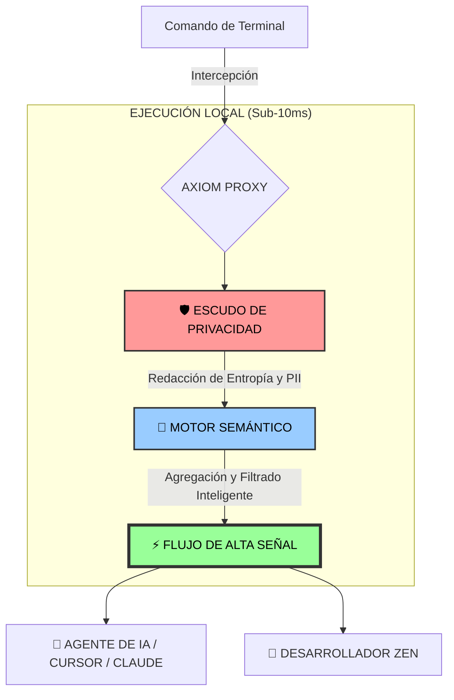

# Documentación de Axiom

Bienvenido a la documentación oficial de **Axiom**, el transmisor de tokens semánticos para agentes de IA.

---

## 🤔 ¿Por qué Axiom?

Los agentes de IA actuales (como Cursor, Claude Code o Gemini CLI) son increíblemente potentes pero **hambrientos de contexto**. Cuando ejecutas un comando como `npm install`, la terminal genera cientos de líneas de barras de progreso y avisos de dependencias.

**El Problema**:
1.  **Ruido**: El 90% de esa salida es redundante para la IA.
2.  **Costo**: Pagas por cada token de ese ruido.
3.  **Privacidad**: Podrías enviar accidentalmente claves API o secretos embebidos en los logs al proveedor del LLM.

**La Solución**:
Axiom actúa como un **Firewall Semántico**. Intercepta la salida de tus comandos localmente, redacta secretos, colapsa el ruido repetitivo en líneas únicas y entrega un flujo de alta señal a tu agente de IA.

---

## 🏗️ Cómo Funciona: El Embudo de Señal

Axiom actúa como un filtro local de alto rendimiento entre tus herramientas y tu ventana de contexto.

---

- [🚀 Empezando](empezando/instalacion.md)
  - [Instalación](empezando/instalacion.md) - Cómo ponerte en marcha.
  - [Inicio Rápido](empezando/inicio-rapido.md) - Tu primer comando `axiom`.
- [💡 Guía de Usuario](guia-usuario/conceptos-clave.md)
  - [Conceptos Clave](guia-usuario/conceptos-clave.md) - Compresión semántica y escudo de privacidad.
  - [Telemetría y Privacidad](guia-usuario/telemetria-y-privacidad.md) - Qué recolectamos (y qué no).
  - [Referencia del CLI](guia-usuario/referencia-cli.md) - Todos los comandos explicados.
- [🤖 Integración con IA](integracion-ia/agentes.md)
  - [Instrucciones para Agentes](integracion-ia/agentes.md) - Cómo decirle a tu IA que use Axiom.
- [🛠️ Guía del Desarrollador](guia-desarrollador/arquitectura.md)
  - [Arquitectura](guia-desarrollador/arquitectura.md) - Cómo está construido el núcleo en Rust.
  - [Creación de Schemas](guia-desarrollador/schemas.md) - Añade soporte para nuevas herramientas CLI.
  - [Plugins WASM](guia-desarrollador/plugins.md) - Extiende Axiom con WebAssembly.
  - [Contribuyendo](guia-desarrollador/contribuyendo.md) - Únete a la comunidad.
- [🗺️ Gestión del Proyecto](proyecto/roadmap.md)
  - [Roadmap](proyecto/roadmap.md) - Progreso actual y visión de futuro.
  - [Log de Desarrollo](proyecto/log-desarrollo.md) - Bitácora técnica interna.
  - [Panel de Control Pulse](proyecto/pulse-control-plane.md) - Centro de observabilidad independiente.

---

## 📚 Glosario

- **Firewall Semántico**: El concepto central de Axiom. Filtra la salida basándose en su *significado* (semántica), no solo con regex simples.
- **Token Streamer**: Se refiere a la capacidad de Axiom de "transmitir" solo los tokens más relevantes a un LLM.
- **Escáner de Entropía**: Una herramienta que calcula la "aleatoriedad" de una cadena. Una alta entropía suele indicar una clave API o un secreto.
- **Schema**: Un archivo de configuración YAML que le indica a Axiom cómo se comporta una herramienta específica (como `npm` o `git`).
- **Ventana de Contexto del LLM**: La cantidad limitada de texto que un modelo de IA puede procesar a la vez. Axiom ahorra este valioso espacio.
